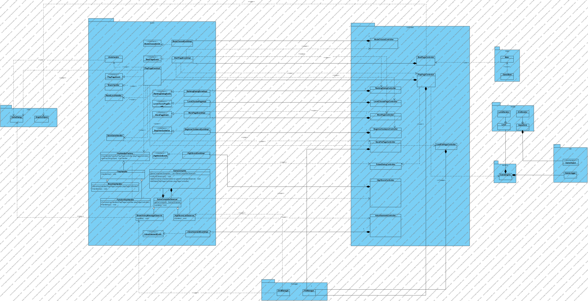
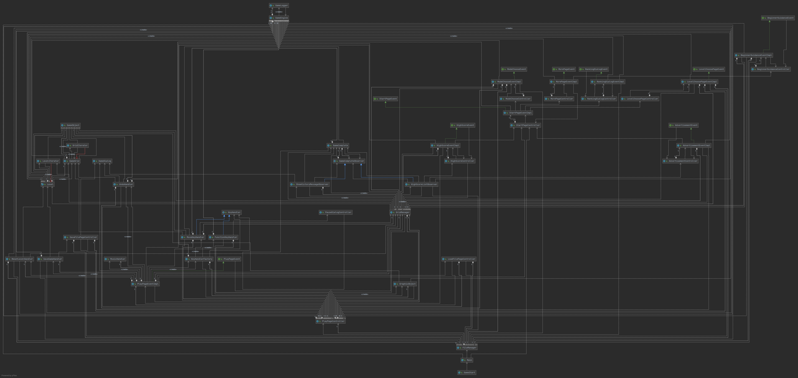

# README 

## Overview

> **ATTENTION: DO NOT USE WITHOUT PROPER CITATION**

*@author Gaole DAI (Gloria)* 🐧

📩[gd25@rice.edu](mailto:gd25@rice.edu) 

📝Coursework of re-implementing the game Sokoban.

Environment - JavaFX 15 and Java JDK 15

Tools: IntelliJ IDEA Community Edition 2020.2.2 and IntelliJ IDEA 2020.3 x64

## Daily Development

Oct. 23 2020 

Try to run the provided source code.

Oct. 24 2020

Carefully re-read the specification and make notes.

Oct. 30 2020

Try to add Maven to the file, but failed.

Oct. 31 2020

Successfully add Maven to the file -> could package .jar file and run the .jar file.

Nov. 1 2020

Modify README.md

Nov. 2  - Nov. 8 2020

Start to go through the source code and add Javadoc, but slowly...

Start to think about how to refactor the code.

Nov. 9 2020

Learn MVC pattern

Nov. 10 2020

Learn design pattern and finish last week's lab exercise

Learn draw class diagram using Markdown file and try to implement the class diagram of the original code.

Nov. 11 2020

Design start menu and game main menu

Nov. 13 2020

Delete the original menu, then add the start and game main menu.

Nov. 14 2020

Think about the refactoring

Nov. 20 2020

Start to write unit test and refactoring

Nov. 21 - Nov. 22 2020

Complete a partial refactoring

Nov. 23 2020

Write toggle music function

Nov. 24 2020

Write reset level function

Add shortcut keys in the PlayPage.fxml menuItem

Nov. 25 2020

Implement load file function

Nov. 26 2020

Implement save file function

Nov. 27 2020

Implement undo function

Additional setting theme feature

Nov. 28 2020

Debug

Add timer and implement the pause game feature

Nov. 29 2020

Ranking

Nov. 30 2020

Level Chooser

Dec. 1 2020

Fix incorrect time bug

Beginner guidance

Show time and moves in play page

Dec. 2 2020

Challenge mode

Dec. 3 2020

Refactoring again

Rewrite Javadoc

Fix bugs

Dec. 4 2020

Write README file and Javadoc

Dec. 5 2020

Re-implement the load and save file

Find bugs

Dec. 6 2020

Finish README.md

Finish Javadoc

Fix jar package save file and load file problem

Dec. 7 2020

Finish the video and re-draw the class diagram

Finish the coursework!!!!

tag-version 1.0

## Goal

Maintenance and Extension

OO design patterns 

GUI design patterns 

Refactoring methodologies

## Idea

- [x] Start page - 
  - Gif background
  - Four buttons: 
    - Start button (to start from the beginning stage or the last stage? not decide yet)
    - Level button (choose unlocked levels)
    - Setting button (color theme, music, shortcut key)
    - More button (include the **rule** and **exit** maybe)
- [x] Ranking - decrease, save the ranking
- [x] Undo - go back one step.
- [x] Reset level - go back to the initial state
- [x] Toggle music - 
- [x] Save game - save the current state including level and position
- [x] Load game - load the last stage
- [ ] Count steps for every level - prompt after every level
- [x] Time counter 
- [x] Change circle characteristic to other more beautiful characteristics
- [ ] Level re-create
  - Push different colors of the box into their matching color target - increase the difficulty.
- [ ] Maze solver - give solution... too difficult...
- [x] Choose player picture - theme setting
- [x] Level chooser
- [x] Beginner Tutorial
- [x] Show time and moves
- [x] Challenge Mode
- [x] Advertisement
- [x] Re-implement the load and save file

## Refactoring

### Refactoring map

Quick Wins

- [x] Remove dead code
- [x] Remove code duplicates
- [x] Enhance identifier naming
- [x] Reduce method size

Divide&Conquer

- [x] Discover&split code into components
- [x] Enhance component encapsulation
- [x] Reduce coupling

Inject Quality In

- [x] Cover components with automated tests
- [x] Enhance components internal design

### Basic

- Fowler Defined Different Categories of Refactoring
- Refactoring Reduces Repetitions and Helps Focus on Objects
- Encapsulate Fields to Retain Private Variables
- Encapsulating Fields Automatically with IDEs
- Extract Method From A Larger Block of Code
- Create A New Method to Perform The Method Extraction
- Using “Extract Method” 
- Replace Parameter with Explicit Method
- Inline Method to Reduce Indirection
- Replace Temporary with Query
- Rename Variable or Method to Self Document
- Remove Assignments to Parameters

### Higher level

- Replace type code with polymorphism
  - Refactor switch statement and if statement - subclass

* Single Responsibility with extract class
  * One class does the jobs of two - break one class into two
* Generalization with extract interface

## Class Diagram

Before Refactoring:

``` mermaid
 classDiagram

 	  Iterable <|-- GameGrid: implements
 	  GameLogger --|> Logger: extends
 	  GraphicObject --|> Rectangle: extends
 	  Iterable~GameObject~ <|-- Level: implements
 	  Iterable~GameObject~ <|-- GridIterator: implements
 	  Iterable~GameObject~ <|-- LevelIterator: implements
 	  Main --|> Application: extends
	  class Iterable{
	  		<<interface>>
	  }
	  class Rectangle{
	  		<<interface>>
	  }
	  class Logger{
	  		<<interface>>
	  }
	  class Iterable~GameObject~{
	  		<<interface>>
	  }
	  
	  class GameEngine{
	  		+String GAME_NAME = "SokobanFX"
	  		+GameLogger logger
	  		-boolean debug = false
	  		+int moveCount = 0
	  		+String mapSetName
	  		-Level currentLevel
	  		-List~string~ levels
	  		-boolean gameComplete = false
	  		
	  		+GameEngine(InputStream input, boolean production)
	  		+isDebugActive()$:boolean
	  		+handleKey(KeyCode code):void
	  		-move(Point delta):void
	  		-loadGameFile(InputStream input):List~Level~
	  		+isGameComplete():boolean
	  		+getNextLevel():Level
	  		+getCurrentLevel():Level
	  		+toggleDebug():void
	  }
	  class GameGrid{
	  		int COLUMNS
	  		int ROWS
	  		-GameObject[][] gameObjects
	  		
	  		+GameGrid(int columns, int rows)
	  		translatePoint(Point sourceLocation, Point delta)$:Point
	  		+getDimension():Dimension
	  		getTargetFromSource(Point source, Point delta):GameObject
	  		+getGameObjectAt(int col, int row):GameObject
	  		+getGameObjectAt(Point p):GameObject
	  		+removeGameObjectAt(Point position):boolean
	  		+putGameObjectAt(GameObject gameObject, int x, int y):boolean
	  		+putGameObjectAt(GameObject gameObject, Point p):boolean
	  		-isPointOutOfBounds(int x, int y):boolean
	  		-isPointOutOfBounds(Point p):boolean
	  		+toString():String
	  		+iterator():Iterator~GameObject~
	  }
	  class GridIterator{
	  		int row = 0
	  		int column = 0
	  		
	  		+hasNext():boolean
	  		+next():GameObject
	  }
	  class GameLogger{
	  		-Logger logger
	  		-DateFormat dateFormat
	  		-Calendar calendar
	  		+GameLogger()
	  		
	  		-createFormattedMessage(String message):String
	  		+info(String message):void
	  		+warning(String message):void
	  		+severe(String message):void
	  }
	  class GameObject{
	  		<<enumeration>>
	  		WALL
	  		FLOOR
	  		CRATE
	  		DIAMOND
	  		KEEPER
	  		CRATE_ON_DIAMOND
	  		DEBUG_OBJECT
	  		
	  		+char symbol
	  		GameObject(final char symbol)
	  		+fromChar(char c)$:GameObject
	  		+getStringSymbol():String
	  		+getCharSymbol():char
	  }
	  class GameStart{
	  		+main(String[] args)$:void
	  }
	  class GraphicObject{
	   		GraphicObject(GameObject obj)
	  }
	  class Level{
	  		+GameGrid objectsGrid
	  		+GameGrid diamondsGrid
	  		-String name
	  		-int index
	  		-int numberOfDiamonds = 0
	  		-Point keeperPosition
	  		
	  		+Level(String levelName, int levelIndex, List~String~ raw_level)
	  		isComplete():boolean
	  		+getName():String
	  		getIndex():int
	  		getKeeperPosition():Point
	  		getTargetObject(Point source, Point delta):GameObject
	  		+toString():String
	  		+iterator():Iterator~GameObject~
	  }
	   class LevelIterator{
	       int column = 0
	       int row = 0
	       
	       +hasNext():boolean
	       +next():GameObject
	       +getCurrentPosition():Point
	   }
	   class Main{
	     -Stage primaryStage;
	     -GameEngine gameEngine;
	     -GridPane gameGrid;
	     -File saveFile;
	     -MenuBar menu;
	     
	      +main(String[] args)$:void
	      +start(Stage primaryStage):void
	      loadDefaultSaveFile(Stage primaryStage):void
	      -initializeGame(InputStream input):void
	      -setEventFilter():void
	      -loadGameFile():void
	      -reloadGrid():void
	      -showVictoryMessage():void
	      -newDialog(String dialogTitle, String dialogMessage, Effect dialogMessageEffect):void
	      -addObjectToGrid(GameObject gameObject, Point location):void
	   	  +closeGame():void
	   	  +saveGame():void
	   	  +loadGame():void
	   	  +undo():void
	   	  +resetLevel():void
	   	  +showAbout():void
	   	  +toggleMusic():void
	   	  +toggleDebug():void
	   	  
	   }
```

Refactoring:
	  

## Copyright

&copy Gaole Dai

All rights reserved.
